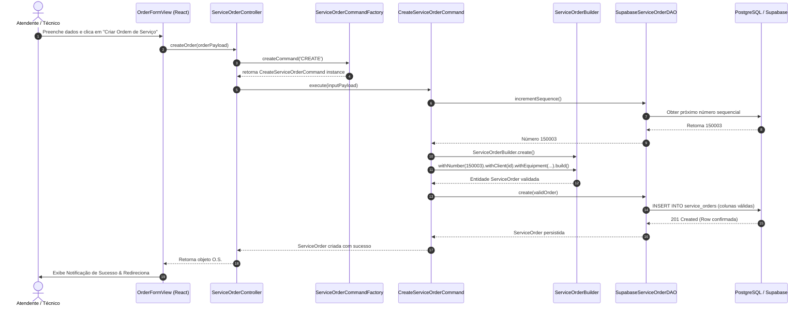
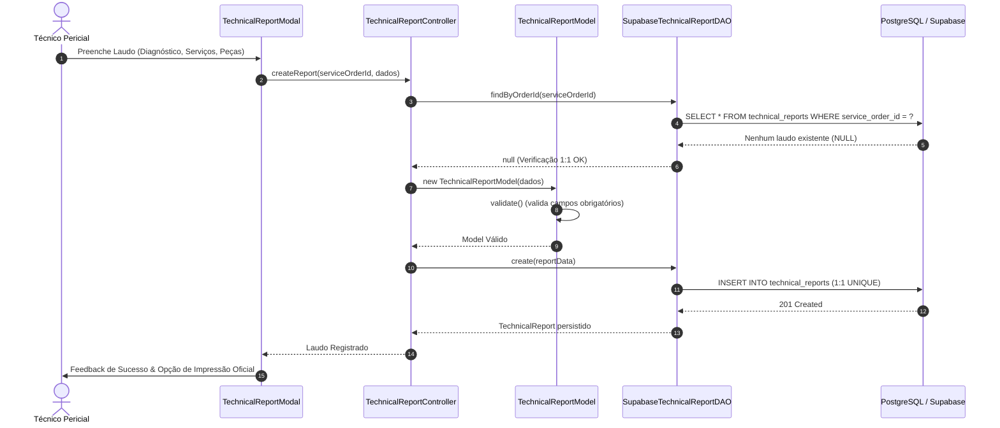

# N! Games — Arquitetura de Software e Documentação Técnica

Este documento descreve a arquitetura profissional do sistema **N! Games (Gerenciamento de Ordens de Serviço e Assistência Técnica Especializada)**, detalhando os padrões de projeto (Design Patterns GoF), princípios SOLID, diagramas UML em Mermaid, modelagem relacional do banco de dados (PostgreSQL/Supabase) e fluxo arquitetural MVC.

---

## 1. Visão Geral da Arquitetura MVC

O sistema é construído sobre o padrão **Model-View-Controller (MVC)** em camadas desacopladas, assegurando alta coesão e baixo acoplamento:

```
[ VIEW ] (React + TypeScript + Tailwind CSS)
   │
   ▼
[ CONTROLLER ] (ClientController, ServiceOrderController, TechnicalReportController)
   │
   ▼
[ FACTORY METHOD ] (ServiceOrderCommandFactory)
   │
   ▼
[ COMMAND PATTERN ] (CreateServiceOrderCommand, UpdateServiceOrderCommand, etc.)
   │
   ├──▶ [ BUILDER PATTERN ] (ServiceOrderBuilder)
   ▼
[ DATA ACCESS OBJECT - DAO ] (IClientDAO, IServiceOrderDAO, ITechnicalReportDAO)
   │
   ▼
[ DATABASE ] (PostgreSQL / Supabase Cloud + Local Mirror)
```

### Divisão de Responsabilidades:

1. **Model (`/src/models/` e `/src/types.ts`)**:
   - `ClientModel`, `ServiceOrderModel`, `TechnicalReportModel`, `StatusHistoryModel`.
   - Encapsulam as regras de domínio, validação de invariantes, tipagem estrita e integridade referencial.
2. **View (`/src/components/`)**:
   - Componentes React puros e reativos (`OrderFormView`, `OrdersListView`, `OrderPrintModal`, `TechnicalReportModal`, `ClientsListView`).
   - Não executam chamadas SQL ou lógica de banco de dados; delegam as intenções do usuário aos Controllers e Services.
3. **Controller (`/src/controllers/`)**:
   - `ClientController`, `ServiceOrderController`, `TechnicalReportController`.
   - Controllers **NÃO** acessam o banco de dados diretamente; orquestram validações, fluxos e delegam execução a Commands e DAOs.
4. **DAO Pattern (`/src/dao/` e `/src/interfaces/`)**:
   - `IClientDAO`, `IServiceOrderDAO`, `ITechnicalReportDAO`, `IStatusHistoryDAO`.
   - Implementações: `SupabaseClientDAO`, `SupabaseServiceOrderDAO`, `SupabaseTechnicalReportDAO`, `SupabaseStatusHistoryDAO`.
   - Isola a regra de negócio da tecnologia de persistência.
5. **Services de Negócio (`/src/services/ServiceOrderBusinessService.ts`)**:
   - Centraliza regras de automação de transição de status, geração automática de datas, garantias legais (90 dias) e auditoria.

---

## 2. Padrões de Projeto Aplicados (Design Patterns GoF)

### 2.1. DAO Pattern (Data Access Object)
- **Objetivo**: Abstrair e encapsular todo o acesso à fonte de dados (Supabase/PostgreSQL/Cache).
- **Interfaces**:
  - `IClientDAO`: `findAll()`, `findById()`, `findByCpf()`, `create()`, `update()`, `delete()`
  - `IServiceOrderDAO`: `findAll()`, `findById()`, `create()`, `update()`, `delete()`, `incrementSequence()`
  - `ITechnicalReportDAO`: `findByOrderId()`, `findById()`, `create()`, `update()`, `delete()`
  - `IStatusHistoryDAO`: `findByOrderId()`, `create()`
- **Vantagem**: A aplicação não depende do driver ou SDK do Supabase; qualquer banco de dados relacional pode ser plugado implementando as interfaces.

### 2.2. Command Pattern
- **Objetivo**: Encapsular cada operação de negócio de Ordem de Serviço como um objeto que implementa `ICommand<TInput, TOutput>`.
- **Comandos Implementados**:
  - `CreateServiceOrderCommand`: Constrói a O.S. via Builder, valida campos, gera número sequencial e grava histórico inicial.
  - `UpdateServiceOrderCommand`: Atualiza dados técnicos, preservando regras de integridade.
  - `ChangeServiceOrderStatusCommand`: Executa automações de datas (conclusão/saída, retorno com defeito) e persiste histórico formal.
  - `DeleteServiceOrderCommand`: Exclui com integridade referencial.
  - `GetServiceOrderByIdCommand`: Busca e hidrata detalhes da ordem.
  - `ListServiceOrdersCommand`: Lista ordens com filtros tipados.

### 2.3. Factory Method
- **Objetivo**: Fornecer a instância correta do Command sem que o Controller precise acoplar-se às classes concretas.
- **Implementação**: `ServiceOrderCommandFactory.createCommand(type)`
- **Tipos Suportados**: `'CREATE'`, `'UPDATE'`, `'DELETE'`, `'GET_BY_ID'`, `'LIST'`, `'CHANGE_STATUS'`.
- Evita longas cadeias condicionais e promove extensibilidade (Open/Closed Principle).

### 2.4. Builder Pattern
- **Objetivo**: Construir a entidade complexa `ServiceOrder` (com mais de 20 atributos) de forma segura, com validações encadeadas e valores padrão auditáveis.
- **Implementação**: `ServiceOrderBuilder`
- **Exemplo de Uso**:
```typescript
const order = ServiceOrderBuilder.create()
  .withNumber(150003)
  .withClient("cli-123")
  .withEquipment("PlayStation 5")
  .withProblem("Não liga / Luz azul pulsante")
  .withValue(380)
  .withStatus("Em aberto")
  .withEntryDate(new Date().toISOString())
  .build();
```

---

## 3. Demonstração dos Princípios SOLID

| Princípio | Aplicação no Projeto N! Games |
| :--- | :--- |
| **SRP** (Single Responsibility) | Cada Command (`CreateServiceOrderCommand`, `ChangeServiceOrderStatusCommand`) possui uma única responsabilidade. Os DAOs cuidam apenas da persistência. |
| **OCP** (Open/Closed) | Novos comandos ou status podem ser criados adicionando novas classes sem modificar o núcleo do sistema. A `ServiceOrderCommandFactory` aceita novos tipos facilmente. |
| **LSP** (Liskov Substitution) | Todas as implementações concretas (`SupabaseClientDAO`, `SupabaseServiceOrderDAO`) honram estritamente os contratos das interfaces `IClientDAO` e `IServiceOrderDAO`. |
| **ISP** (Interface Segregation) | Interfaces específicas e granulares (`IClientDAO`, `ITechnicalReportDAO`, `IStatusHistoryDAO`) em vez de uma interface genérica e sobrecarregada. |
| **DIP** (Dependency Inversion) | Controllers e Commands dependem de abstrações (interfaces `IServiceOrderDAO`, `IClientDAO`), nunca diretamente das classes de implementação ou do Supabase. |

---

## 4. Modelagem de Dados e Relacionamentos

### 4.1. Relacionamento 1:N (Um para Muitos)
- **`clients` 1 ---- N `service_orders`**
- Um cliente pode possuir múltiplas ordens de serviço ao longo do tempo.
- Chave estrangeira: `service_orders.cliente_id REFERENCES clients(id) ON DELETE CASCADE`.

- **`service_orders` 1 ---- N `service_order_status_history`**
- Cada ordem de serviço registra todas as transições de status com data/hora, status anterior, status novo, observação e usuário.
- Chave estrangeira: `service_order_status_history.service_order_id REFERENCES service_orders(id) ON DELETE CASCADE`.

### 4.2. Relacionamento 1:1 Estrito (Um para Um)
- **`service_orders` 1 ---- 1 `technical_reports` (Laudo Técnico Pericial)**
- Cada ordem de serviço possui **no máximo UM laudo técnico** exclusivo.
- Chave estrangeira com restrição de unicidade: `service_order_id TEXT NOT NULL UNIQUE REFERENCES service_orders(id) ON DELETE CASCADE`.
- Impede a criação de múltiplos laudos para a mesma O.S. no banco e nas camadas de domínio (Model, DAO e Controller).

---

## 5. Diagrama de Classes UML (Mermaid)

```mermaid
classDiagram
    direction TB

    class ICommand~TInput, TOutput~ {
        <<interface>>
        +execute(input: TInput) Promise~TOutput~
    }

    class IServiceOrderDAO {
        <<interface>>
        +findAll() Promise~ServiceOrder[]~
        +findById(id: string) Promise~ServiceOrder~
        +create(order: ServiceOrder) Promise~ServiceOrder~
        +update(id: string, data: Partial) Promise~ServiceOrder~
        +delete(id: string) Promise~boolean~
        +incrementSequence() Promise~number~
    }

    class ITechnicalReportDAO {
        <<interface>>
        +findByOrderId(orderId: string) Promise~TechnicalReport~
        +create(report: TechnicalReport) Promise~TechnicalReport~
        +update(orderId: string, data: Partial) Promise~TechnicalReport~
        +delete(orderId: string) Promise~boolean~
    }

    class ServiceOrderBuilder {
        -data: Partial~ServiceOrder~
        +create() ServiceOrderBuilder
        +withNumber(num: number) ServiceOrderBuilder
        +withClient(clientId: string) ServiceOrderBuilder
        +withEquipment(equip: string) ServiceOrderBuilder
        +withProblem(defeito: string) ServiceOrderBuilder
        +withValue(val: number) ServiceOrderBuilder
        +withStatus(status: OrderStatus) ServiceOrderBuilder
        +build() ServiceOrder
    }

    class ServiceOrderCommandFactory {
        -orderDAO: IServiceOrderDAO
        -historyDAO: IStatusHistoryDAO
        +createCommand(type: ServiceOrderCommandType) ICommand
    }

    class CreateServiceOrderCommand {
        -orderDAO: IServiceOrderDAO
        -historyDAO: IStatusHistoryDAO
        +execute(input: CreateServiceOrderInput) Promise~ServiceOrder~
    }

    class ChangeServiceOrderStatusCommand {
        -orderDAO: IServiceOrderDAO
        -historyDAO: IStatusHistoryDAO
        +execute(input: ChangeServiceOrderStatusInput) Promise~ServiceOrder~
    }

    class ServiceOrderController {
        -commandFactory: ServiceOrderCommandFactory
        +listOrders() Promise~ServiceOrder[]~
        +getOrderById(id: string) Promise~ServiceOrder~
        +createOrder(input) Promise~ServiceOrder~
        +changeStatus(input) Promise~ServiceOrder~
    }

    class TechnicalReportController {
        -reportDAO: ITechnicalReportDAO
        +getReportByOrderId(orderId: string) Promise~TechnicalReport~
        +createReport(input) Promise~TechnicalReport~
        +updateReport(orderId: string, input) Promise~TechnicalReport~
    }

    class Client {
        +string id
        +string nome
        +string cpf
        +string telefone
        +string cep
        +string endereco
    }

    class ServiceOrder {
        +string id
        +number numero
        +string clienteId
        +string situacao
        +string equipamento
        +string entrada
        +string saida
        +string prazo
        +number valor
        +OrderItem[] itens
    }

    class TechnicalReport {
        +string id
        +string serviceOrderId
        +string diagnostico
        +string servicoRealizado
        +string pecasUtilizadas
        +string observacaoTecnica
        +string tecnicoResponsavel
        +string dataAnalise
    }

    class StatusHistoryEntry {
        +string id
        +string de
        +string para
        +string data
        +string observacao
    }

    %% Relacionamentos de Domínio
    Client "1" -- "0..*" ServiceOrder : possui (1:N)
    ServiceOrder "1" -- "0..1" TechnicalReport : possui laudo (1:1)
    ServiceOrder "1" -- "0..*" StatusHistoryEntry : histórico (1:N)

    %% Relacionamentos de Padrões
    ServiceOrderController ..> ServiceOrderCommandFactory : solicita command
    ServiceOrderCommandFactory ..> ICommand : instancia
    CreateServiceOrderCommand ..|> ICommand : implementa
    ChangeServiceOrderStatusCommand ..|> ICommand : implementa
    CreateServiceOrderCommand ..> ServiceOrderBuilder : utiliza
    CreateServiceOrderCommand ..> IServiceOrderDAO : persiste
    TechnicalReportController ..> ITechnicalReportDAO : delega
```

---

## 6. Diagrama de Sequência UML — Criação de O.S. (Mermaid)

Demonstra o fluxo desacoplado: View ➔ Controller ➔ Factory ➔ Command ➔ Builder ➔ DAO ➔ Database:



---

## 7. Diagrama de Sequência UML — Emissão de Laudo Técnico 1:1 (Mermaid)

Demonstra a garantia da restrição 1:1 e persistência do laudo pericial:



---

## 8. Automação de Processos de Negócio Implementadas

1. **Numeração Sequencial Atômica**:
   - Geração automática e garantia de não-duplicação (`app_config` / sequence no PostgreSQL).
2. **Entrada Temporal Automática**:
   - Data e hora de abertura gravadas no instante da criação, protegidas contra adulteração.
3. **Automação de Datas por Status**:
   - Status alterado para **Concluído**: preenche automaticamente a data de saída (`saida`) e data de retirada se balcão.
   - Status alterado para **Retornou com defeito**: registra automaticamente `dataRetorno`, `retornoAt` e solicita obrigatoriamente o motivo da reincidência.
4. **Proteção de Integridade do Histórico**:
   - Ordens com status `Concluído` bloqueiam edição acidental de campos mestres (Equipamento, Cliente e Data de Entrada).
5. **Garantia Legal CDC**:
   - Cálculo automático dos 90 dias legais de garantia contados a partir da data de entrega/retirada.
