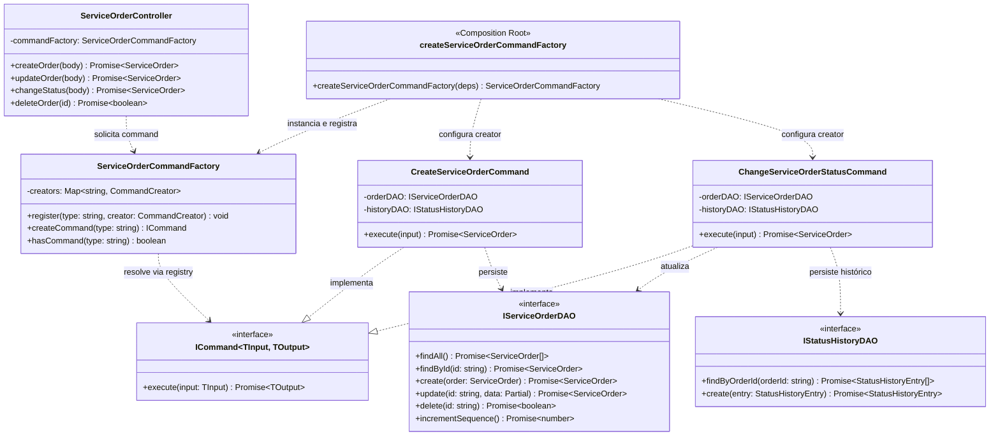
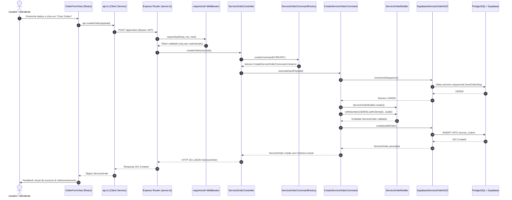
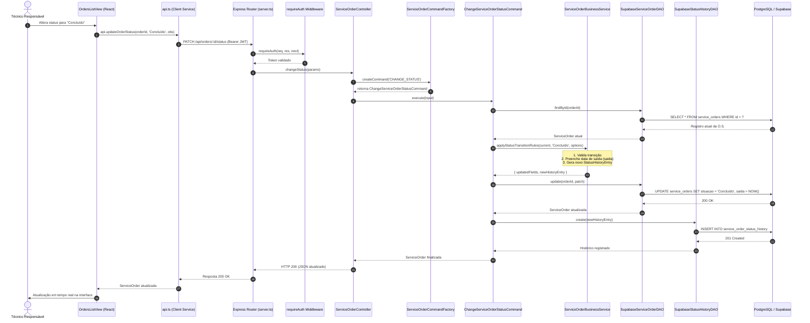

# N! Games — Arquitetura de Software e Documentação Técnica

Este documento descreve a arquitetura do sistema **N! Games (Gerenciamento de Ordens de Serviço e Assistência Técnica Especializada)**, detalhando os padrões de projeto (Design Patterns GoF), princípios SOLID, diagramas UML em Mermaid, modelagem relacional do banco de dados (PostgreSQL/Supabase) e fluxo arquitetural MVC.

---

## 1. Visão Geral da Arquitetura MVC

O sistema é construído sobre o padrão **Model-View-Controller (MVC)** em camadas desacopladas, assegurando alta coesão e baixo acoplamento:

```
[ VIEW ] (React + TypeScript + Tailwind CSS)
   │
   ▼ (HTTP REST + Bearer JWT)
[ API SERVICE ] (src/services/api.ts)
   │
   ▼
[ EXPRESS ROUTER & MIDDLEWARE ] (server.ts + requireAuth)
   │
   ▼
[ CONTROLLER ] (ClientController, ServiceOrderController, TechnicalReportController)
   │
   ▼
[ FACTORY METHOD & REGISTRY ] (ServiceOrderCommandFactory ➔ Map<CommandType, CommandCreator>)
   │                                  ▲
   │                         (createServiceOrderCommandFactory - Composition Root)
   ▼
[ COMMAND PATTERN ] (CreateServiceOrderCommand, ChangeServiceOrderStatusCommand, etc.)
   │
   ├──▶ [ BUILDER PATTERN ] (ServiceOrderBuilder)
   ├──▶ [ BUSINESS SERVICE ] (ServiceOrderBusinessService)
   ▼
[ DATA ACCESS OBJECT - DAO ] (IClientDAO, IServiceOrderDAO, ITechnicalReportDAO, IStatusHistoryDAO)
   │
   ▼
[ DATABASE ] (PostgreSQL / Supabase BaaS + Local Mirror)
```

### Divisão de Responsabilidades:

1. **Model (`/src/types.ts` e `/src/models/`)**:
   - `Client`, `ServiceOrder`, `TechnicalReport`, `ServiceOrderStatusHistory`.
   - Encapsulam as regras de domínio, tipagem estrita e integridade referencial.
2. **View (`/src/components/`)**:
   - Componentes React puros e reativos (`OrderFormView`, `OrdersListView`, `OrderPrintModal`, `TechnicalReportModal`, `ClientsListView`).
   - Não executam chamadas SQL ou lógica de banco de dados; delegam as operações à camada `api.ts`.
3. **Controller (`/src/controllers/`)**:
   - `ClientController`, `ServiceOrderController`, `TechnicalReportController`.
   - Controllers **NÃO** acessam o banco de dados diretamente; orquestram validações, fluxos e delegam execução a Commands e DAOs.
4. **DAO Pattern (`/src/dao/` e `/src/interfaces/`)**:
   - `IClientDAO`, `IServiceOrderDAO`, `ITechnicalReportDAO`, `IStatusHistoryDAO`.
   - Implementações: `SupabaseClientDAO`, `SupabaseServiceOrderDAO`, `SupabaseTechnicalReportDAO`, `SupabaseStatusHistoryDAO`.
   - Isola a regra de negócio da tecnologia de persistência.
5. **Services de Negócio (`/src/services/ServiceOrderBusinessService.ts`)**:
   - Centraliza regras de automação de transição de status, geração automática de datas, garantias legais (90 dias) e auditoria de histórico.

---

## 2. Padrões de Projeto Aplicados (Design Patterns GoF)

### 2.1. DAO Pattern (Data Access Object)
- **Objetivo**: Abstrair e encapsular todo o acesso à fonte de dados (Supabase/PostgreSQL).
- **Interfaces**:
  - `IClientDAO`: `findAll()`, `findById()`, `findByCpf()`, `create()`, `update()`, `delete()`.
  - `IServiceOrderDAO`: `findAll()`, `findById()`, `create()`, `update()`, `delete()`, `incrementSequence()`.
  - `ITechnicalReportDAO`: `findByOrderId()`, `findById()`, `create()`, `update()`, `delete()`.
  - `IStatusHistoryDAO`: `findByOrderId()`, `create()`, `deleteByOrderId()`.

### 2.2. Command Pattern
- **Objetivo**: Encapsular cada operação de negócio de Ordem de Serviço como um objeto que implementa `ICommand<TInput, TOutput>`.
- **Comandos Implementados**:
  - `CreateServiceOrderCommand`: Constrói a O.S. via Builder, valida campos, gera número sequencial e grava histórico inicial.
  - `UpdateServiceOrderCommand`: Atualiza dados técnicos, preservando regras de integridade.
  - `ChangeServiceOrderStatusCommand`: Executa automações de datas (conclusão/saída, retorno com defeito) via `ServiceOrderBusinessService` e persiste histórico formal.
  - `DeleteServiceOrderCommand`: Exclui com integridade referencial.
  - `GetServiceOrderByIdCommand`: Busca e hidrata detalhes da ordem.
  - `ListServiceOrdersCommand`: Lista ordens com filtros tipados.

### 2.3. Factory Method (Command Factory & Registry)
- **Objetivo**: Fornecer a instância correta de `ICommand` sem que o Controller precise conhecer as classes concretas.
- **Estrutura**:
  - `ServiceOrderCommandFactory`: Mantém um `Map<CommandType, CommandCreator>` e o método `createCommand(type)` para invocar o creator correspondente. Não possui switch ou acoplamento a classes concretas.
  - `createServiceOrderCommandFactory` (Composition Root): Configura e registra os criadores de comando (`CREATE`, `UPDATE`, `DELETE`, `GET_BY_ID`, `LIST`, `CHANGE_STATUS`) com suas respectivas injeções de dependência.
- **Open/Closed Principle (OCP)**: Novos comandos podem ser registrados em tempo de execução via `factory.register()` sem modificar a lógica interna de `createCommand()`.

### 2.4. Builder Pattern
- **Objetivo**: Construir a entidade complexa `ServiceOrder` (com mais de 20 atributos) de forma segura, com validações encadeadas e valores padrão auditáveis.
- **Implementação**: `ServiceOrderBuilder`

---

## 3. Demonstração dos Princípios SOLID

| Princípio | Aplicação no Projeto N! Games |
| :--- | :--- |
| **SRP** (Single Responsibility) | Cada Command (`CreateServiceOrderCommand`, `ChangeServiceOrderStatusCommand`) possui uma única responsabilidade. Os DAOs cuidam apenas da persistência. |
| **OCP** (Open/Closed) | Novos comandos são registrados dinamicamente via `register()` na `ServiceOrderCommandFactory` sem modificar `createCommand()`. |
| **LSP** (Liskov Substitution) | Todas as implementações concretas (`SupabaseClientDAO`, `SupabaseServiceOrderDAO`) honram estritamente os contratos das interfaces `IClientDAO` e `IServiceOrderDAO`. |
| **ISP** (Interface Segregation) | Interfaces específicas e granulares (`IClientDAO`, `ITechnicalReportDAO`, `IStatusHistoryDAO`) em vez de uma interface genérica sobrecarregada. |
| **DIP** (Dependency Inversion) | Controllers e Commands dependem de abstrações (`IServiceOrderDAO`, `IClientDAO`, `ICommand`), nunca de classes concretas de banco de dados. |

---

## 4. Modelagem de Dados e Relacionamentos

### 4.1. Relacionamento 1:N (Um para Muitos)
- **`clients` 1 ---- N `service_orders`**
  - Chave estrangeira: `service_orders.cliente_id REFERENCES clients(id) ON DELETE CASCADE`.
- **`service_orders` 1 ---- N `service_order_status_history`**
  - Cada ordem de serviço registra todas as transições de status com data/hora, status anterior, status novo, observação e usuário.
  - Chave estrangeira: `service_order_status_history.service_order_id REFERENCES service_orders(id) ON DELETE CASCADE`.

### 4.2. Relacionamento 1:1 Estrito (Um para Um)
- **`service_orders` 1 ---- 0..1 `technical_reports`**
  - Cada Ordem de Serviço pode possuir **no máximo um** Laudo Técnico Pericial.
  - Chave estrangeira: `technical_reports.service_order_id REFERENCES service_orders(id) ON DELETE CASCADE UNIQUE`.

---

## 5. Diagrama de Classes UML (Mermaid)



---

## 6. Diagrama de Sequência UML — Criação de O.S. (Fluxo Completo)

Demonstra o fluxo real: Usuário ➔ React View ➔ API Service ➔ HTTP Request ➔ Express Router ➔ requireAuth ➔ ServiceOrderController ➔ Factory ➔ Command ➔ Builder ➔ DAO ➔ Supabase:



---

## 7. Diagrama de Sequência UML — Alteração de Status com Automação

Demonstra o fluxo da automação de negócio: leitura do estado atual, aplicação de regras de data/saída, persistência e auditoria de histórico:


